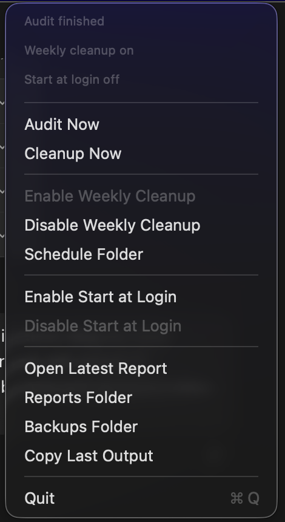

# Codex Maintenance Bar

A macOS menu bar app, standalone maintenance scripts, and Codex skill for auditing, backing up, archiving, restoring, and safely cleaning local Codex Desktop state.

It lives in the status bar, not the Dock. Look for the small hammer/checkmark icon near the clock.

## Architecture


`codex-maintenance-bar` is now the canonical repo for the whole workflow:

- `Sources/CodexMaintenanceBar`: SwiftUI menu bar app.
- `codex_weekly_maintenance.py`: canonical weekly maintenance script for CLI use.
- `Sources/CodexMaintenanceBar/Resources/`: bundled app copies of the weekly, workspace-artifact, and archived-chat cleanup helpers.
- `codex-maintenance/`: installable Codex skill with its own weekly maintenance script copy.
- `script/sync_maintenance_script.sh`: keeps weekly maintenance script copies identical.
- `tests/`: regression tests for audit, cleanup, restore, and lock behavior.

The app launches bundled Python helpers for manual audits and cleanups. The scheduler installs a user LaunchAgent and copies the weekly maintenance script to Application Support for recurring cleanup. The CLI and Codex skill use the same root weekly script behavior, while the menu bar app adds focused artifact and archived-chat cleanup actions.

The earlier `Codex Cleaner` prototype was useful for the scan-and-review idea, but this repo is now the recommended merged direction: a menu bar app with deterministic scripts, reports, backups, and confirmations for destructive actions.

## Screenshot



## How This Keeps Codex Fast

Codex Desktop can feel slower when local active history, session transcripts, logs, stale workspaces, and dead project config build up over time. The menu bar app keeps that maintenance repeatable: run an audit, run cleanup, schedule weekly cleanup, and open the report afterward.

Cleanup helps by closing Codex first, backing up local state, archiving old non-pinned active chats, updating the local state database, creating handoff docs, moving stale workspaces to an archive folder, rotating oversized logs, and pruning config entries for missing paths.

The extra artifact tools handle cleanup work that the weekly maintenance script intentionally avoids: regenerable workspace build folders, virtual environments, Python caches, exact duplicate older version files, derived page-render folders when a final PDF/PPTX exists, and archived chat transcripts after a dedicated backup.

This does not change model speed, network latency, cloud service behavior, or the size of the currently open chat before it is archived. It reports heavy background Node/dev-server processes, but it does not kill them automatically.

## What It Does

- `Audit Now`: read-only check of Codex sessions, logs, config, and workspaces. Opens the report when finished.
- `Cleanup Now`: closes Codex first, backs up state, archives stale active sessions, rotates logs, prunes dead config paths, writes a report, and opens it when finished.
- `Audit Workspace Artifacts`: dry-runs a manifest-backed pass over `~/Documents/Codex` for regenerable build/dependency/cache folders, exact duplicate older version files, and derived page renders.
- `Clean Workspace Artifacts`: removes only those generated workspace artifacts after writing a CSV manifest and Markdown report.
- `Audit Archived Chats`: previews archived chat transcript removal and shows how much space archived transcripts use.
- `Prune Archived Chats`: closes Codex, backs up archived transcripts and state, removes archived chat transcript files, deletes archived rows from the local state database, updates the session index, and verifies database integrity.
- `Enable Weekly Cleanup`: installs a macOS LaunchAgent that runs cleanup every Monday at 9:00 AM.
- `Disable Weekly Cleanup`: removes the LaunchAgent.
- `Schedule Folder`: opens the LaunchAgent log/script folder.
- `Enable Start at Login`: opens the menu bar app automatically after login/restart.
- `Disable Start at Login`: removes that login LaunchAgent.
- `Open Latest Report`: opens the newest Markdown maintenance report.
- `Reports Folder`: opens `~/.codex/maintenance_reports`.
- `Backups Folder`: opens `~/.codex/maintenance_backups`.
- `Copy Last Output`: copies the last script output to the clipboard.

## Install

From this repo:

```sh
./script/install.sh
```

This builds the app, installs it to:

```text
~/Applications/CodexMaintenanceBar.app
```

and opens it. `install.sh` also enables start at login, so the menu bar app reappears after a restart.

## Reopen After Quitting

If you click `Quit` in the menu bar app, the icon disappears. To open it again:

```sh
open ~/Applications/CodexMaintenanceBar.app
```

or from this repo:

```sh
./script/open_app.sh
```

You can also open `~/Applications` in Finder and double-click `CodexMaintenanceBar.app`.

## Run Without Installing

Build and launch from the repo:

```sh
./script/build_and_run.sh
```

The built app bundle is staged at:

```text
dist/CodexMaintenanceBar.app
```

If you quit it, reopen the staged build with:

```sh
open dist/CodexMaintenanceBar.app
```

## CLI Usage

Audit only:

```sh
python3 codex_weekly_maintenance.py --write-report
```

Apply cleanup after quitting Codex:

```sh
python3 codex_weekly_maintenance.py --apply --write-report
```

Close Codex first, then apply cleanup:

```sh
python3 codex_weekly_maintenance.py --quit-codex --force-quit-codex --apply --write-report
```

Restore a backup:

```sh
python3 codex_weekly_maintenance.py --quit-codex --restore-backup /path/to/maintenance_backups/YYYYMMDDTHHMMSSZ
```

Preview generated workspace artifacts:

```sh
python3 Sources/CodexMaintenanceBar/Resources/codex_workspace_artifact_cleanup.py --include-derived-page-renders
```

Clean generated workspace artifacts:

```sh
python3 Sources/CodexMaintenanceBar/Resources/codex_workspace_artifact_cleanup.py --apply --include-derived-page-renders
```

Preview archived chat pruning:

```sh
python3 Sources/CodexMaintenanceBar/Resources/codex_archived_chat_prune.py
```

Prune archived chats after closing Codex:

```sh
python3 Sources/CodexMaintenanceBar/Resources/codex_archived_chat_prune.py --quit-codex --force-quit-codex --apply
```

## Codex Skill

The reusable skill lives in:

```text
codex-maintenance/
├── SKILL.md
├── agents/openai.yaml
└── scripts/codex_weekly_maintenance.py
```

To install it manually:

```sh
mkdir -p "${CODEX_HOME:-$HOME/.codex}/skills"
cp -R codex-maintenance "${CODEX_HOME:-$HOME/.codex}/skills/"
```

## Weekly Schedule

The app can install a user LaunchAgent so cleanup runs even when the menu bar app is not open.

From the menu bar app, click:

```text
Enable Weekly Cleanup
```

This creates:

```text
~/Library/LaunchAgents/io.github.yashrajnayak.codex-maintenance.weekly.plist
```

and copies the maintenance script to:

```text
~/Library/Application Support/CodexMaintenanceBar/codex_weekly_maintenance.py
```

The schedule runs every Monday at 9:00 AM and executes:

```sh
/usr/bin/python3 ~/Library/Application\ Support/CodexMaintenanceBar/codex_weekly_maintenance.py --quit-codex --force-quit-codex --apply --write-report
```

You can also enable or disable the schedule from Terminal:

```sh
./script/enable_weekly_cleanup.sh
./script/disable_weekly_cleanup.sh
```

Scheduled-run logs live in:

```text
~/Library/Application Support/CodexMaintenanceBar/
```

## Open Automatically After Restart

The app uses a LaunchAgent login item:

```text
~/Library/LaunchAgents/io.github.yashrajnayak.codex-maintenance-bar.login.plist
```

Enable it from the menu bar app:

```text
Enable Start at Login
```

or from Terminal:

```sh
./script/enable_start_at_login.sh
```

Disable it with:

```sh
./script/disable_start_at_login.sh
```

Check whether it is loaded:

```sh
launchctl print "gui/$(id -u)/io.github.yashrajnayak.codex-maintenance-bar.login"
```

## Keeping Script Copies In Sync

After editing `codex_weekly_maintenance.py`, refresh the app and skill copies:

```sh
./script/sync_maintenance_script.sh
```

Check without changing files:

```sh
./script/sync_maintenance_script.sh --check
```

CI runs the same check.

## Verify

```sh
./script/sync_maintenance_script.sh --check
python3 -m py_compile codex_weekly_maintenance.py codex-maintenance/scripts/codex_weekly_maintenance.py Sources/CodexMaintenanceBar/Resources/*.py tests/test_codex_weekly_maintenance.py
python3 -m unittest discover -s tests -v
./script/build_and_run.sh --verify
```

## Important Safety Note

`Cleanup Now` and `Prune Archived Chats` close the Codex desktop app before touching its local state database. That means any active Codex chat window may disappear during cleanup.

Run `Audit Now`, `Audit Workspace Artifacts`, or `Audit Archived Chats` first if you want a read-only preview. Keep backups until you have reopened Codex and confirmed everything looks right.

Archived chat pruning creates a dedicated backup before deleting anything and runs SQLite integrity checks after the database update.
