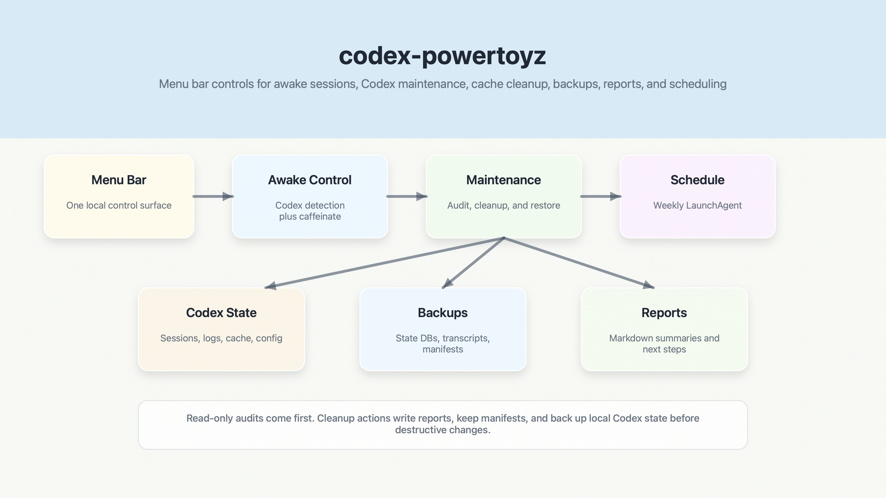

# codex-powertoyz

A macOS menu bar utility for keeping Codex-friendly local workflows awake, auditable, backed up, and clean.

It lives in the status bar, not the Dock. Look for the wand icon near the clock.

This is an unofficial local utility and is not affiliated with OpenAI.

## Architecture



`codex-powertoyz` combines a few focused local tools:

- `Sources/CodexPowertoyz`: SwiftUI menu bar app.
- `Sources/CodexPowertoyz/Resources/`: bundled weekly, workspace-artifact, Codex-cache, and archived-chat cleanup helpers.
- `codex_weekly_maintenance.py`: standalone weekly maintenance script for CLI use.
- `codex-maintenance/`: installable Codex skill with its own weekly maintenance script copy.
- `script/sync_maintenance_script.sh`: keeps weekly maintenance script copies identical.
- `tests/`: regression tests for audit, cleanup, restore, and lock behavior.

The app launches bundled Python helpers for manual audits and cleanups, wraps macOS `caffeinate` for awake sessions, and can install a user LaunchAgent for weekly maintenance.

## What It Does

- `Auto While Codex Runs`: detects the local Codex app and keeps the Mac awake while Codex is running.
- `Keep Awake Until Stopped`: starts a manual awake session.
- `Keep Awake for 1 Hour` / `Keep Awake for 2 Hours`: starts a timed awake session.
- `Stop Keeping Awake`: stops the active awake session.
- `Audit Now`: read-only check of Codex sessions, logs, config, and workspaces. Shows a native result window when finished.
- `Cleanup Now`: closes Codex first, backs up state, archives stale active sessions, rotates logs, prunes dead config paths, writes a report, and shows a native result window when finished.
- `Audit Workspace Artifacts`: dry-runs a manifest-backed pass over `~/Documents/Codex` for regenerable build/dependency/cache folders, exact duplicate older version files, and derived page renders.
- `Clean Workspace Artifacts`: removes only those generated workspace artifacts after writing a CSV manifest and Markdown report.
- `Audit Codex Cache`: dry-runs high-confidence cleanup candidates under `~/.codex`, including old maintenance backups, old rotated log archives, rebuildable `.tmp` cache, and orphan generated images.
- `Clean Codex Cache...`: moves those high-confidence cache candidates into a timestamped macOS Trash folder after writing a CSV manifest and Markdown report.
- `Preview Archived Chat Prune`: dry-run preview of archived chat transcript removal and how much space archived transcripts use.
- `Prune Archived Chats...`: closes Codex, backs up archived transcripts and state, removes archived chat transcript files, deletes archived rows from the local state database, updates the session index, and verifies database integrity.
- `Enable Weekly Cleanup`: installs a macOS LaunchAgent that runs cleanup every Monday at 9:00 AM.
- `Enable Start at Login`: opens the menu bar app automatically after login/restart.
- `Show Last Result`: reopens the latest in-app result window without launching a code editor.

## How Awake Mode Works

Awake mode starts macOS' built-in `caffeinate` command:

```sh
/usr/bin/caffeinate -dimsu -w <app-pid>
```

That keeps the display and system awake while the session is active and drops the assertion automatically if the app exits. It does not edit Lock Screen settings, require admin privileges, or modify Codex.

If your organization enforces screen locking through MDM or security policy, awake mode may not override that policy.

## How Cleanup Works

Codex Desktop can feel slower when local active history, session transcripts, logs, stale workspaces, and dead project config build up over time. The maintenance tools make that cleanup repeatable: run an audit, run cleanup, schedule weekly cleanup, and open the report afterward.

Cleanup helps by closing Codex first, backing up local state, archiving old non-pinned active chats, updating the local state database, creating handoff docs, moving stale workspaces to an archive folder, rotating oversized logs, and pruning config entries for missing paths.

The artifact tools handle cleanup work that weekly maintenance intentionally avoids: regenerable workspace build folders, virtual environments, Python caches, exact duplicate older version files, derived page-render folders when a final PDF/PPTX exists, high-confidence Codex cache artifacts, and archived chat transcripts after a dedicated backup.

Codex cache cleanup is intentionally narrow and reversible. It keeps the newest general maintenance backup, newest archived-chat-prune backup, and newest rotated-log archive, then moves older restore/log snapshots, rebuildable `.codex/.tmp` children, and `generated_images` folders with no matching thread row into a timestamped folder under `~/.Trash`.

This does not change model speed, network latency, cloud service behavior, or the size of the currently open chat before it is archived. It reports heavy background Node/dev-server processes, but it does not kill them automatically.

## Install

From this repo:

```sh
./script/install.sh
```

This builds the app, installs it to:

```text
~/Applications/codex-powertoyz.app
```

and opens it. `install.sh` also enables start at login, so the menu bar app reappears after a restart.

## Reopen After Quitting

If you click `Quit` in the menu bar app, the icon disappears. To open it again:

```sh
open ~/Applications/codex-powertoyz.app
```

or from this repo:

```sh
./script/open_app.sh
```

## Run Without Installing

Build and launch from the repo:

```sh
./script/build_and_run.sh
```

The built app bundle is staged at:

```text
dist/codex-powertoyz.app
```

If you quit it, reopen the staged build with:

```sh
open dist/codex-powertoyz.app
```

## CLI Usage

Audit only:

```sh
python3 codex_weekly_maintenance.py --write-report
```

Apply cleanup after quitting Codex:

```sh
python3 codex_weekly_maintenance.py --apply --write-report
```

Close Codex first, then apply cleanup:

```sh
python3 codex_weekly_maintenance.py --quit-codex --force-quit-codex --apply --write-report
```

Restore a backup:

```sh
python3 codex_weekly_maintenance.py --quit-codex --restore-backup /path/to/maintenance_backups/YYYYMMDDTHHMMSSZ
```

Preview generated workspace artifacts:

```sh
python3 Sources/CodexPowertoyz/Resources/codex_workspace_artifact_cleanup.py --include-derived-page-renders
```

Clean generated workspace artifacts:

```sh
python3 Sources/CodexPowertoyz/Resources/codex_workspace_artifact_cleanup.py --apply --include-derived-page-renders
```

Preview high-confidence Codex cache artifacts:

```sh
python3 Sources/CodexPowertoyz/Resources/codex_cache_cleanup.py
```

Move high-confidence Codex cache artifacts to Trash:

```sh
python3 Sources/CodexPowertoyz/Resources/codex_cache_cleanup.py --apply
```

Preview archived chat pruning:

```sh
python3 Sources/CodexPowertoyz/Resources/codex_archived_chat_prune.py
```

Prune archived chats after closing Codex:

```sh
python3 Sources/CodexPowertoyz/Resources/codex_archived_chat_prune.py --quit-codex --force-quit-codex --apply
```

## Codex Skill

The reusable maintenance skill lives in:

```text
codex-maintenance/
├── SKILL.md
├── agents/openai.yaml
└── scripts/codex_weekly_maintenance.py
```

To install it manually:

```sh
mkdir -p "${CODEX_HOME:-$HOME/.codex}/skills"
cp -R codex-maintenance "${CODEX_HOME:-$HOME/.codex}/skills/"
```

## Weekly Schedule

The app can install a user LaunchAgent so cleanup runs even when the menu bar app is not open.

From the menu bar app, click:

```text
Enable Weekly Cleanup
```

This creates:

```text
~/Library/LaunchAgents/io.github.yashrajnayak.codex-powertoyz.weekly-maintenance.plist
```

and copies the maintenance script to:

```text
~/Library/Application Support/codex-powertoyz/codex_weekly_maintenance.py
```

The schedule runs every Monday at 9:00 AM and executes:

```sh
/usr/bin/python3 ~/Library/Application\ Support/codex-powertoyz/codex_weekly_maintenance.py --quit-codex --force-quit-codex --apply --write-report
```

You can also enable or disable the schedule from Terminal:

```sh
./script/enable_weekly_cleanup.sh
./script/disable_weekly_cleanup.sh
```

Scheduled-run logs live in:

```text
~/Library/Application Support/codex-powertoyz/
```

## Open Automatically After Restart

The app uses a LaunchAgent login item:

```text
~/Library/LaunchAgents/io.github.yashrajnayak.codex-powertoyz.login.plist
```

Enable it from the menu bar app:

```text
Enable Start at Login
```

or from Terminal:

```sh
./script/enable_start_at_login.sh
```

Disable it with:

```sh
./script/disable_start_at_login.sh
```

Check whether it is loaded:

```sh
launchctl print "gui/$(id -u)/io.github.yashrajnayak.codex-powertoyz.login"
```

## Keeping Script Copies In Sync

After editing `codex_weekly_maintenance.py`, refresh the app and skill copies:

```sh
./script/sync_maintenance_script.sh
```

Check without changing files:

```sh
./script/sync_maintenance_script.sh --check
```

CI runs the same check.

## Verify

```sh
./script/sync_maintenance_script.sh --check
python3 -m py_compile codex_weekly_maintenance.py codex-maintenance/scripts/codex_weekly_maintenance.py Sources/CodexPowertoyz/Resources/*.py tests/*.py
python3 -m unittest discover -s tests -v
./script/build_and_run.sh --verify
```

## Safety

`Cleanup Now` and `Prune Archived Chats` close the Codex desktop app before touching its local state database. That means any active Codex chat window may disappear during cleanup.

Run `Audit Now`, `Audit Workspace Artifacts`, or `Audit Archived Chats` first if you want a read-only preview. Keep backups until you have reopened Codex and confirmed everything looks right.

Archived chat pruning creates a dedicated backup before deleting anything and runs SQLite integrity checks after the database update.
